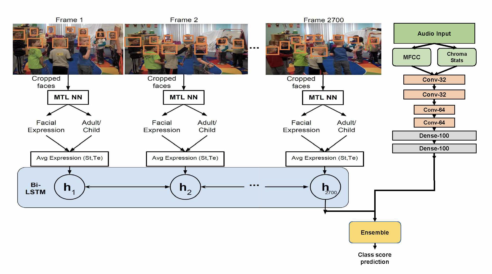

# lit review for kids enjoyment detector
1. **Dewan, M. A. A., Murshed, M., & Lin, F. (2019). Engagement detection in online learning: a review. *Smart Learning Environments*, *6*(1), 1-20.** 
   - Extensive review paper
2. **Ramakrishnan, A., Ottmar, E., LoCasale-Crouch, J., & Whitehill, J. (2019, May). Toward automated classroom observation: Predicting positive and negative climate. In 2019 14th IEEE international conference on automatic face & gesture recognition (FG 2019) (pp. 1-8). IEEE.**
   - MTL : transfer learning VGG16 pre-trained on ImageNet without "unlcear" images  + 2 dense layers binary detectors
   - 
   - Pearson r=.40 and .51 for positive and negative climate w.r.t. ground-truth
3. **Ramakrishnan, A., Zylich, B., Ottmar, E., LoCasale-Crouch, J., & Whitehill, J. (2021). Toward automated classroom observation: Multimodal machine learning to estimate class positive climate and negative climate. IEEE Transactions on Affective Computing.**
   - Created ACORN (Automatic Classroom Observation Recognition Network) which can predict positive and negative climate with Pearson r=.55 and .63 w.r.t. labels provided by expert CLASS coders. The best performing model with the accuracy stated is Resnet CNN backbone + TCN (reduce accuracy but faster training) + attention
4. **Altuwairqi, K., Jarraya, S. K., Allinjawi, A., & Hammami, M. (2021). Student behavior analysis to measure engagement levels in online learning environments. *Signal, Image and Video Processing*, 1-9.**
   - to offer robust and accurate student engagement measures, combine and analyze three modalities representing students’ behaviors: emotions from facial expressions, keyboard keystrokes, and mouse movements. 
   - built new and realistic student engagement datasets
   - lit review on student engagement
   - **[mini-Xception](https://iopscience.iop.org/article/10.1088/1757-899X/1042/1/012027/pdf) for emotion detection**
   - reference to Raksarikorn, T., & [Kangkachit, T.](https://scholar.google.com/citations?user=30xlCxYAAAAJ&hl=en&oi=sra) (2018, July). Facial expression classification using deep extreme inception networks. In *2018 15th International Joint Conference on Computer Science and Software Engineering (JCSSE)* (pp. 1-5). IEEE.
     - Dhurakij Pundit University 🤔
   - 
5. **Tonguç, G., & Ozkara, B. O. (2020). Automatic recognition of student emotions from facial expressions during a lecture. *Computers & Education*, *148*, 103797.**
   - Used off-the-shelf Microsoft Emotion Recognition API to measure 67 students in the classroom
   - probably useful literature on learning and the use of facial expression recognition
   - Cited **Sahla, K. S., & Kumar, T. S. (2016, September). Classroom teaching assessment based on student emotions. In *The International Symposium on Intelligent Systems Technologies and Applications* (pp. 475-486). Springer, Cham.** >> not interesting
6. **Dewan, M. A. A., Lin, F., Wen, D., Murshed, M., & Uddin, Z. (2018, October). A deep learning approach to detecting engagement of online learners. In *2018 IEEE SmartWorld, Ubiquitous Intelligence & Computing, Advanced & Trusted Computing, Scalable Computing & Communications, Cloud & Big Data Computing, Internet of People and Smart City Innovation (SmartWorld/SCALCOM/UIC/ATC/CBDCom/IOP/SCI)* (pp. 1895-1902). IEEE.**
   - use Local Directional Pattern (LDP) to extract person-independent edge features for the different facial expressions and Kernel Principal Component Analysis (KPCA) to capture the nonlinear correlations among the extracted features. 
   - the Dataset for Affective States in E-Environments (DAiSEE)
   - classify into 2-level engagement (not-engaged and engaged) and three-level (not-engaged, normally-engaged and very-engaged)
   - don't have access yet
7. **Thomas, C., & Jayagopi, D. B. (2017, November). Predicting student engagement in classrooms using facial behavioral cues. In *Proceedings of the 1st ACM SIGCHI international workshop on multimodal interaction for education* (pp. 33-40).**
   - used OpenFace
8. **Lopez-Aguilar, A. A., Bustamante-Bello, R., & Navarro-Tuch, S. A. (2021, April). Advanced System to Measure UX in Online Learning Environments. In *2021 IEEE Global Engineering Education Conference (EDUCON)* (pp. 774-777). IEEE.**
   - no access yet
9. **Yu, H., Gupta, A., Lee, W., Arroyo, I., Betke, M., Allesio, D., ... & Woolf, B. P. (2021, July). Measuring and Integrating Facial Expressions and Head Pose as Indicators of Engagement and Affect in Tutoring Systems. In *International Conference on Human-Computer Interaction* (pp. 219-233). Springer, Cham.**
   - probably not that important. 
   - [researchgate link](https://www.researchgate.net/profile/Beverly-Woolf/publication/352935062_Measuring_and_Integrating_Facial_Expressions_and_Head_Pose_as_Indicators_of_Engagement_and_Affect_in_Tutoring_Systems/links/61115b7c0c2bfa282a3063cf/Measuring-and-Integrating-Facial-Expressions-and-Head-Pose-as-Indicators-of-Engagement-and-Affect-in-Tutoring-Systems.pdf)

## data

- schools (regular, tutoring) record online learning sessions -- Edsy
- datasets in literature
