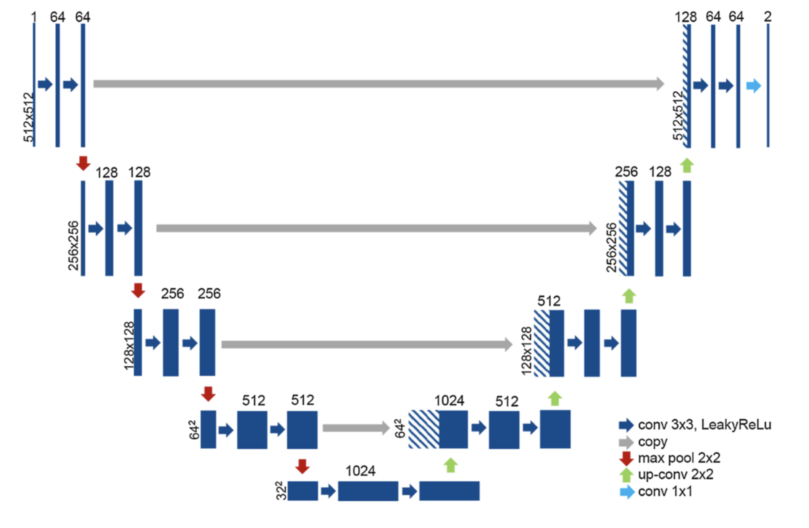

# meticuly - convert ct scan images to 3d model

so many papers...i can't choose!

## in the meticuly repo

1. Klein, A., Warszawski, J., Hillengaß, J., & Maier-Hein, K. H. (2019). Automatic bone segmentation in whole-body CT images. *International journal of computer assisted radiology and surgery*, *14*(1), 21-29.
   - CNN inspired by U-Net -- encoding-decoding network 
   - training from 2D axial slices,  pseudo-3D axial, sagittal, and coronal slices, network pre-trained unsupervised
   - results for best network -- the one trained from 2D axial slices
     - in-house dataset: dice scores of .95 and IOU (intersection over union) .91 on whole-body CT scans 
     - Peréz-Carrasco method: dice score .92 and IOU .85
2. Minnema, J., van Eijnatten, M., Kouw, W., Diblen, F., Mendrik, A., & Wolff, J. (2018). CT image segmentation of bone for medical additive manufacturing using a convolutional neural network. *Computers in biology and medicine*, *103*, 130-139.
3. - Dice .92
4. Noguchi, S., Nishio, M., Yakami, M., Nakagomi, K., & Togashi, K. (2020). Bone segmentation on whole-body CT using convolutional neural network with novel data augmentation techniques. *Computers in biology and medicine*, *121*, 103767.
   - also U-Net based
   - Dice .983 +/- .005 on in-house data set, .943 with secondary dataset, .947 with public dataset